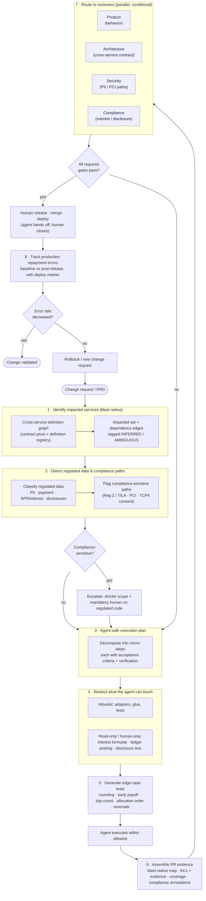
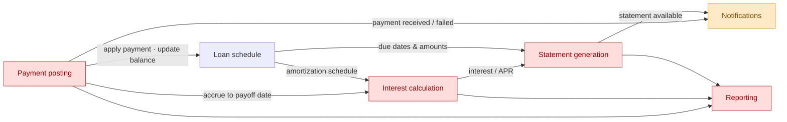

# Agent-safe change workflow — loan repayment

End-to-end pipeline for shipping a change to the repayment domain safely: from
blast-radius analysis through compliance gating, scoped agent execution,
multi-discipline review, and post-release outcome verification. This is the
`PRD → execution plan` north star made concrete for a regulated lending estate.

**Estate under change:** `loan schedule`, `payment posting`,
`interest calculation`, `statement generation`, `notifications`, `reporting`.

---

## Diagram A — end-to-end workflow



---

## Diagram B — service blast radius with regulated-data tagging

Red = regulated financial calculation / disclosure (Reg Z / TILA). Amber =
PII / consent (TCPA). These tags in Stage 2 decide the scope restrictions
(Stage 4) and which reviewers are mandatory (Stage 7).



---

## Stage reference

| # | Stage | What happens | Tooling in this estate | Gate / output |
|---|-------|--------------|------------------------|---------------|
| 1 | **Impacted services** | Traverse the cross-service definition graph from the changed definition; collect downstream services + edges | graphify contract pivot + definition registry (`contract_introspect`, `scip_ingest`, `pg_introspect`) | Blast-radius set, recall-favoring; `AMBIGUOUS` edges kept as candidates |
| 2 | **Regulated data & compliance paths** | Classify nodes/edges carrying PII, payment, interest/APR, disclosure data; mark cross-boundary flows of regulated data | node metadata + compliance classifier pass | Compliance tags → drive Stages 4 & 7 |
| 3 | **Agent-safe execution plan** | Decompose into micro-steps, each with acceptance criteria + a verification method; regulated steps flagged human-only | ROS agent loop (`ros-agent-loop`, `claim_issue`, ACs) | Plan with ACs; plan-mode approval before edits |
| 4 | **Restrict agent scope** | Derive allowlist (adapters, glue, tests) and read-only/human-only denylist (formulae, ledger, disclosures) from Stages 1–2 | Claude Code permissions (`settings.json` allow/deny), path guards, `ros-accountability` | Enforced write boundary; regulated code untouchable by agent |
| 5 | **Edge-case tests** | Generate tests for repayment failure modes (below) | `hypothesis` property tests + `pytest` golden tests | Failing-first tests committed before impl |
| 6 | **PR evidence** | Bundle blast-radius map, ACs met + evidence (test logs, CI), scoped diff, coverage, compliance annotations | ROS `link_pull_request` + `update_acceptance_criterion(evidence=...)` | Evidence pack attached to PR |
| 7 | **Reviewer routing** | Route in parallel; required reviewers are conditional on Stage-2 tags | CODEOWNERS + conditional-on-tag routing | Product always; Architecture if cross-service; Security if PII/PCI; Compliance if interest/disclosure |
| 8 | **Outcome tracking** | Baseline the production repayment-error metric *before* release; compare after, keyed to the deploy marker | Datadog (metrics, monitors, DORA deployments) | Errors ↓ → validated; else rollback → new change request |

### Edge cases the Stage-5 generator must cover (repayment-specific)
- **Rounding**: half-cent allocation, cumulative rounding drift over a schedule.
- **Payment shape**: overpayment, underpayment, partial payment, zero/negative balance.
- **Early payoff**: interest accrual to exact payoff date; payoff quote vs actual.
- **Day-count conventions**: 30/360 vs actual/365 vs actual/actual; leap years.
- **Allocation order**: fees → interest → principal (and jurisdiction variants).
- **Reversals & refunds**: NSF reversal, chargeback, double-post idempotency.
- **Timing**: posting timezone/cutoff, backdated payments, concurrent payments.
- **Late/missed**: late-fee assessment, grace period boundaries, re-aging.

---

## The accountability boundary (non-negotiable)
The agent **executes** within its allowlist and **hands off** (`mark_dev_done`); it
never merges, waives an acceptance criterion, or touches regulated code. A human
**releases** (reviews and closes), and the close gate re-checks every AC. Any path
tagged compliance-sensitive in Stage 2 is human-authored, not agent-authored —
the agent may propose a diff for it, but a human owns the change.

## The outcome metric (define before release)
"Production repayment errors" must be a concrete, pre-baselined metric — e.g.
mis-posted payment rate, incorrect-interest incidents, failed schedule updates
per 1k payments. Stage 8 compares the post-release window against that baseline,
anchored to the deployment marker, and the result feeds back into the queue: a
non-decrease is itself a new change request, closing the loop.
```
